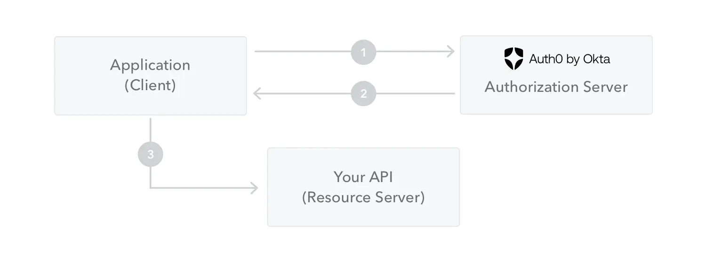

# JWT

JSON Web Tokens consist of three parts separated by dots (.), which are:

- Header
- Payload
- Signature

Therefore, a JWT typically looks like the following:

```
xxxxx.yyyyy.zzzzz
```

## Header

The header _typically_ consists of two parts: the type of the token, which is JWT,
and the signing algorithm being used, such as HMAC SHA256 or RSA.

For example:
```json
{
  "alg": "HS256",
  "typ": "JWT"
}
```

Then, this JSON is **Base64Url** encoded to form the first part of the JWT.

## Payload

The second part of the token is the payload, which contains the **claims**. Claims
are statements about an entity (typically, the user) and additional data. There
are three types of claims: _registered_, _public_, and _private_ claims.

- **Registered claims**: These are a set of predefined claims which are not
  mandatory but recommended, to provide a set of useful, interoperable claims.
  Some of them are: **iss** (issuer), **exp** (expiration time), **sub**
  (subject), **aud** (audience), and **others**.

- **Public claims**: These can be defined at will by those using JWTs. But to avoid
  collisions, they should be defined in the IANA JSON Web Token Registry or be
  defined as a URI that contains a collision-resistant namespace.

- **Private claims**: These are the custom claims created to share information
  between parties that agree on using them and are neither _registered_ or _public_
  claims.

An example payload could be:

```json
{
  "sub": "1234567890",
  "name": "John Doe",
  "admin": true
}
```

The payload is then Base64Url encoded to form the second part of the JSON Web Token.

⚠️: Do note that for signed tokens, this information, though protected against
tampering, is readable by anyone. Do not put secret information in the payload
or header elements of a JWT unless it is encrypted.

## Signature
To create the signature part you have to take the encoded header, the encoded
payload, a secret, the algorithm specified in the header, and sign that.

For example, if you want to use the HMAC SHA256 algorithm, the signature will be
created in the following way:

```
HMACSHA256(
  base64UrlEncode(header) + "." +
  base64UrlEncode(payload),
  secret)
```

The signature is used to verify the message wasn't changed along the way, and,
in the case of tokens signed with a private key, it can also verify that the
sender of the JWT is who it says it is.


## How do JSON Web Tokens work?

In authentication, when the user successfully logs in using their credentials, a
JSON Web Token will be returned. Since tokens are credentials, great care must
be taken to prevent security issues. In general, you should not keep tokens
longer than required.

Whenever the user wants to access a protected route or resource, the user agent
should send the JWT, typically in the **Authorization** header using the
**Bearer** schema. The content of the header should look like the following:

```
Authorization: Bearer <token>
```



1. The application or client requests authorization to the authorization server.
   This is performed through one of the different authorization flows. For
   example, a typical OpenID Connect compliant web application will go through
   the /oauth/authorize endpoint using the authorization code flow.
2. When the authorization is granted, the authorization server returns an access
   token to the application.
3. The application uses the access token to access a protected resource (like an
   API).

Do note that with signed tokens, all the information contained within the token
is exposed to users or other parties, even though they are unable to change it.
This means you should not put secret information within the token.
